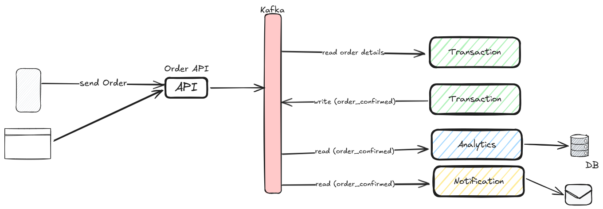

# Kafka-Demo

## Description
This project is a demonstration of how to use Apache Kafka with Python. It includes examples of Kafka producers and consumers, as well as the necessary configuration to run Kafka locally.




## Installation
1. Clone the repository:
    ```sh
    git clone https://github.com/rvbrandao/Kafka-Demo.git
    cd Kafka-Demo
    ```

2. Create a virtual environment and activate it:
    ```sh
    python -m venv venv
    source venv/bin/activate  # On Windows use `venv\Scripts\activate`
    ```

3. Install the dependencies:
    ```sh
    pip install -r requirements.txt
    ```

## Using Docker Compose
4. Ensure you have Docker and Docker Compose installed on your machine
    ```sh
    docker-compose up -d
    ```

## Execution
1. To start the Kafka producer, run:
    ```sh
    python producer/order_backend.py 
    python producer/transaction.py 
    ```

2. To start the Kafka consumer, run:
    ```sh
    python consumer/user_notification.py
    python consumer/analytics.py
    ```

## Python Files
- `producer/order_backend.py`: Simulates receiving client 'order' from the front-end and sending it to Kafka.
- `producer/transaction.py`: Simulates receiving 'order_details' from the backend to process each order.
- `consumer/analytics.py`: Simulates receiving 'order_confirmed' from transaction and analyze this order.
- `consumer/user_notification.py`: Simulates receiving 'order_confirmed' from transaction and sending a message to the user about the order.
